# 🤖 MCP Notetaking Agent

A simplified AI agent powered by Google Gemini 2.0 Flash and LangChain's ReAct framework for intelligent question-answering with automatic conversation history saving.

## Current Implementation

**Simple & Clean**: Ask questions, get AI responses, save complete conversation history on exit.

```mermaid
graph TD
    A["🚀 Start Application<br/>python agent_langchain.py"] --> B["⚙️ Initialize Agent<br/>Silent Setup"]
    
    B --> C["🧠 Setup Components"]
    C --> C1["🤖 Gemini LLM<br/>gemini-2.0-flash"]
    C --> C2["🔍 Google Embeddings<br/>models/embedding-001"]
    C --> C3["📊 FAISS Vector Store<br/>For conversation search"]
    C --> C4["🛠️ Create Tools<br/>Ask Question + Final Answer"]
    C --> C5["🎭 ReAct Agent<br/>hwchase17/react template"]
    C --> C6["⚡ Agent Executor<br/>Orchestration layer"]
    
    C6 --> D["✅ Agent Ready<br/>🤖 MCP Agent Ready<br/>Type 'quit' to exit and save"]
    
    D --> E["💬 User Input<br/>You: [question]"]
    
    E --> F{"🔍 Input Type?"}
    
    F -->|"quit"| G["💾 Save Complete History"]
    F -->|"question"| H["🤖 Process with ReAct Agent"]
    
    H --> H1["🧠 Agent Reasoning<br/>Analyze question"]
    H1 --> H2["🛠️ Tool Selection<br/>Ask Question tool"]
    H2 --> H3["🌐 Gemini API Call<br/>Get AI response"]
    H3 --> H4["📝 Store in History<br/>Q&A pair with timestamp"]
    H4 --> H5["📊 Update Vector Store<br/>FAISS embeddings"]
    H5 --> H6["🎯 Final Answer Tool<br/>Format response"]
    
    H6 --> I["📤 Display Response<br/>Agent: [response]"]
    
    I --> J["🔄 Continue Loop"]
    J --> E
    
    G --> G1["📝 Create Markdown File<br/>conversation_history_TIMESTAMP.md"]
    G1 --> G2["💾 Write All Q&A Pairs<br/>Formatted with timestamps"]
    G2 --> G3["✅ Confirm Save<br/>Display filename"]
    G3 --> K["🏁 Exit Application"]
    
    style A fill:#e1f5fe
    style D fill:#f3e5f5
    style H1 fill:#fff3e0
    style G1 fill:#e8f5e8
    style K fill:#ffebee
```



## Architecture Overview

### **Core Components:**
- **🧠 LLM**: Google Gemini 2.0 Flash (free tier)
- **🔍 Embeddings**: Google's embedding-001 model
- **📊 Vector Store**: FAISS for semantic conversation search
- **🎭 Agent Framework**: LangChain ReAct (Reasoning + Acting)
- **💾 Memory**: Persistent conversation history with auto-save

### **Tools Available:**
1. **Ask Question**: Direct interaction with Gemini AI
2. **Final Answer**: Prevents infinite reasoning loops

### **Key Features:**
- ✅ **Clean Interface**: Minimal terminal output
- ✅ **Smart Responses**: ReAct reasoning for better answers  
- ✅ **Memory Management**: Automatic conversation storage
- ✅ **Error Handling**: Graceful fallbacks for API limits
- ✅ **Vector Search**: Semantic search through conversation history

## Quick Start

### 1. Setup Environment
```bash
# Clone and navigate to project
git clone <repository-url>
cd 101_mcp_agent_v1

# Create virtual environment
python -m venv venv

# Activate virtual environment
# Windows
venv\Scripts\activate
# Mac/Linux  
source venv/bin/activate

# Install dependencies
pip install -r requirements.txt
```

### 2. Configure API Key
Create a `.env` file in the project root:
```env
GOOGLE_API_KEY=your_gemini_api_key_here
```

**Get your FREE Gemini API key**: https://makersuite.google.com/app/apikey

### 3. Run the Agent
```bash
python agent_langchain.py
```

## Usage Example

```
🤖 MCP Agent Ready
Type 'quit' to exit and save conversation history

You: What is machine learning?
Agent: Machine learning is a branch of artificial intelligence that enables computers to learn and make decisions from data without being explicitly programmed...

You: Explain neural networks
Agent: Neural networks are computing systems inspired by biological neural networks...

You: quit
Conversation saved to conversation_history_20250605_143052.md
```

## Output Files

When you type `quit`, the agent automatically saves your complete conversation history to a timestamped markdown file:

**Example: `conversation_history_20250605_143052.md`**
```markdown
# 📝 Complete Conversation History
**Date**: 2025-06-05 14:30:52
**Total Conversations**: 2

---

## Conversation 1
**Time**: 2025-06-05 14:28:15

**Q**: What is machine learning?

**A**: Machine learning is a branch of artificial intelligence...

---

## Conversation 2
**Time**: 2025-06-05 14:29:45

**Q**: Explain neural networks

**A**: Neural networks are computing systems...

---
```

## Features

- ✅ **Zero Configuration**: Works out of the box with minimal setup
- ✅ **Free Tier**: Uses Google Gemini's generous free API
- ✅ **Smart AI**: ReAct framework for intelligent reasoning
- ✅ **Auto-Save**: Complete conversation history saved on exit
- ✅ **Clean Interface**: Minimal, distraction-free terminal UI
- ✅ **Error Resilient**: Graceful handling of API limits and errors